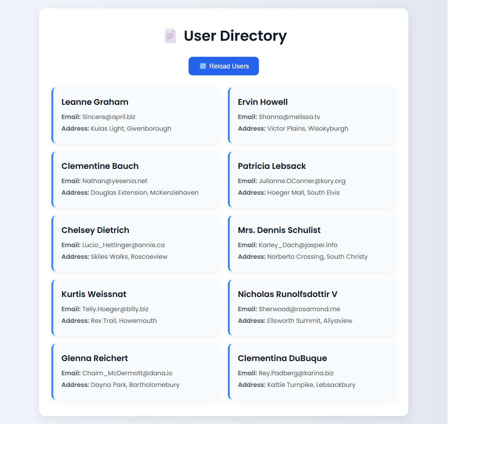

# 🌐 Task 7 - Fetch API Web App

This is my internship task to fetch and display user data from a public REST API using JavaScript's Fetch API.

## 🔗 API Used
[JSONPlaceholder](https://jsonplaceholder.typicode.com/users)

## 💡 Key Features
- Async JavaScript with `fetch`
- API data parsing and rendering
- Error handling and retry
- Fully responsive and styled UI

## 📸 Screenshot

## 🚀 Live Link
[Click here to view](https://madhankumar1701.github.io/Task-7-FetchAPI/)

## 🧠 Concepts Used
- Fetch API
- Promises
- JSON Parsing
- Error Handling
- DOM Manipulation
